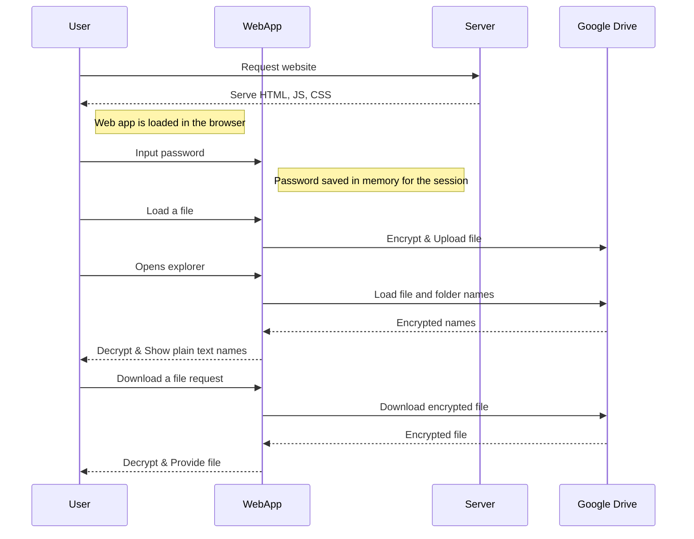

# Secret Drive

Secret Drive is a web application that allows you to store files in Google Drive with encryption. It is a simple and secure way to store your files in the cloud.

```mermaid
sequenceDiagram
    participant U as User
    participant W as WebApp
    participant S as Server
    participant G as Google Drive

    U->>S: Request website
    S-->>U: Serve HTML, JS, CSS
    Note right of U: Web app is loaded in the browser

    U->>W: Input password
    Note right of W: Password saved in memory for the session

    U->>W: Load a file
    W->>G: Encrypt & Upload file

    U->>W: Opens explorer
    W->>G: Load file and folder names
    G-->>W: Encrypted names
    W-->>U: Decrypt & Show plain text names

    U->>W: Download a file request
    W->>G: Download encrypted file
    G-->>W: Encrypted file
    W-->>U: Decrypt & Provide file
```